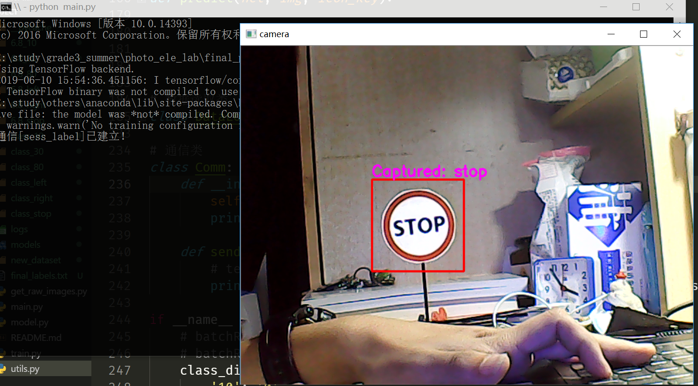

[中文](./README.md)|[English](./en_readme/EN_README.md)

# 光电实验大作业
2018-2019学年，ISEE光电信息综合实验期末大作业。

> 2019.6.10
80和30的分类效果有些小瑕疵，考虑加更多样本训练

## 内容
基于路标识别的无人车自动驾驶。

## Prerequisite
* Python 3.6.4
* Numpy 1.15.4
* Tensorflow 1.12.0
* Keras 2.2.4
* opencv-python 3.4.2.16

## Usage
训练模型前先编辑train.py，之后命令行执行：
```shell
python train.py
```

使用训练好的模型进行推理：
```shell
python main.py
```

## 平台
* 无人车（带有摄像头、无线通信模块）
* PC（用于图像实时处理）

## 实现
计划Solution：
* YOLOv3实时目标检测
* YOLOv3检测结果确定指令
* Socket发送指令

备用Solution：
* 传统方法ROI提取
* VGG风格的网络训练多分类器
* Socket发送指令

*最后用了备用方案，模型训练时间很短，performance也不赖。*

## 文件说明
### 数据集制作
* get_raw_images.py 自动/手动采集车载摄像头图像
* utils.py 一些小工具
    * 图片尺寸调整
    * 圆形目标检测
    * 数据集重命名
    * 数据集自动/手动标注
    * DataLoader数据读入工具

### 模型
* model.py 定义了网络结构
* train.py 定义了训练脚本

### 监控
* main.py 定义了PC端视频流监视界面

目前只实现了单线程执行全部检测、推理、推理结果显示、指令发送，由于推理过程实时性略差，导致推理过程中视频会出现少许卡顿，可考虑后期使用多线程/进程实现推理和实时显示功能分离。

### 通信
<del>* commu.py 定义了通信相关实现</del>

在utils.py中实现了Comm类。

### 效果


