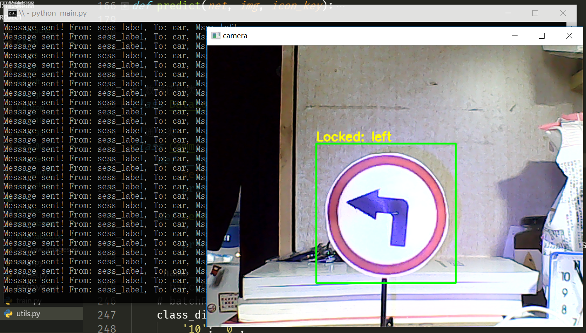

[中文](./README.md)|[English](./en_readme/EN_README.md)

# 基于路标识别的无人车自动驾驶

2018-2019春夏学期，ISEE光电信息综合实验&人工智能大作业。

## 内容

基于路标识别的无人车自动驾驶。

## 依赖

* Python 3.6.4
* Numpy 1.15.4
* Tensorflow 1.12.0
* Keras 2.2.4
* opencv-python 3.4.2.16

## 使用方法

这里不提供训练好的模型，需要自行训练，训练模型前先编辑`train.py`，之后执行：
```shell
python train.py
```

使用训练好的模型进行推理：
```shell
python main.py
```

## 平台

* 无人车：通信模块+控制模块+视频采集模块
* PC：视频流接收+推理+发送命令

## 实现

原本计划使用自行采集的数据集训练YOLOv3模型直接实现目标检测与分类，后因训练以及实时推理算力不足只好放弃。方案改为使用传统方法提取目标，并用简单的CNN进行分类。

## 文件说明
### 数据集制作

* `get_raw_images.py` 采集车载摄像头图像
* `utils.py` 一些小工具
    * 图片尺寸调整
    * 圆形路标检测
    * 数据集重命名
    * 数据集标注
    * DataLoader数据读入工具

### 模型

* `model.py` 定义了网络结构
* `train.py` 定义了训练脚本

### 监控

* `main.py` 定义了PC端视频流监视界面

目前只实现了单线程执行全部检测、推理、推理结果显示、指令发送，受设备所限，推理过程实时性略差，导致推理过程中视频会出现少许卡顿。

### 通信

在`utils.py`中实现了`Comm`类，定义了使用Socket进行命令发送的流程。

通信协议： http://www.wifi-robots.com/thread-3546-1-1.html

### 效果

下面均为PC端实时推理效果演示：


