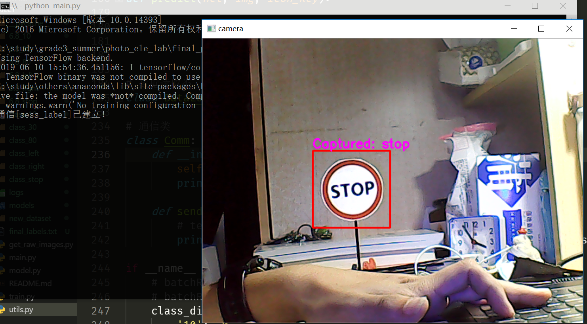
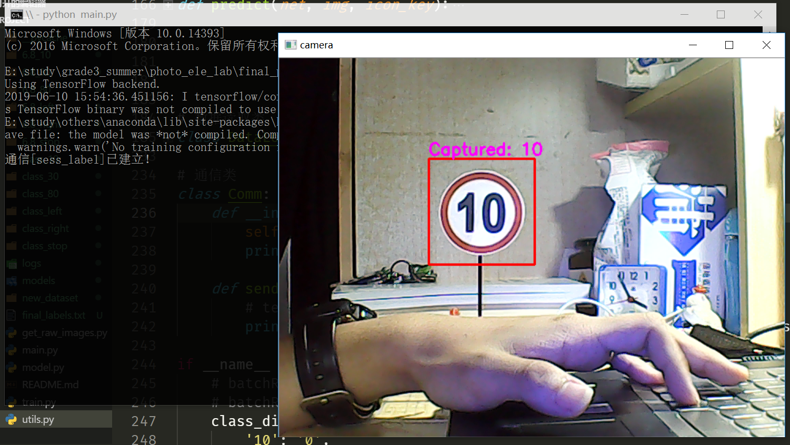
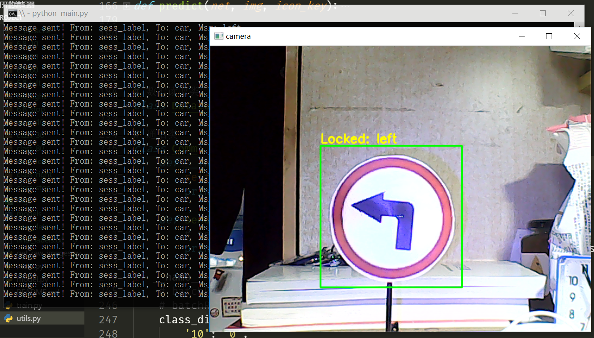

[中文](../README.md)|[English](./EN_README.md)

# Photoelectric Lab Final Project
2019 Summer, ISEE photoelectric lab course final project.

## Content
UGV auto-driving via real-time traffic sign detection.

## Prerequisite
* Python 3.6.4
* Numpy 1.15.4
* Tensorflow 1.12.0
* Keras 2.2.4
* opencv-python 3.4.2.16

## Usage
### Training
If you want to train your own model, edit training configs in `train.py` then run in command line.
```shell
python train.py
```

### Inference
Infer on you own device:
```shell
python main.py
```

## Platform
* UGV (with camera & WiFi module)
* PC (run real-time inference)

## Approaches
Expected solution:
* YOLOv3 for real-time object detection and classification
* Socket communication

Alternative solution:
* Traditional ROI extraction
* VGG style network for classification
* Socket communication

*Finally, the alternative one worked with great performance for this project.*

## Codes
### Dataset Preparation
* `get_raw_images.py` Auto/Manual image sampling
* `utils.py` Tools
    * Resize
    * Circle detection
    * Dataset rename
    * Dataset auto/manual labeling
    * Dataloader

### Model
* `model.py` Network structure definition
* `train.py` Training script definition

### Monitor
* `main.py` defines monitor UI on PC

Currently, detection, inference and result display run in solo-thread, which may lead to lags in the whole process because of the great time consumption in computation. A future improvement can be a rebuild with multi-thread/process approach that will implement inference and real-time display function seperately.

### Communication
`Comm` class is implemented in `utils.py`.

### Demo


